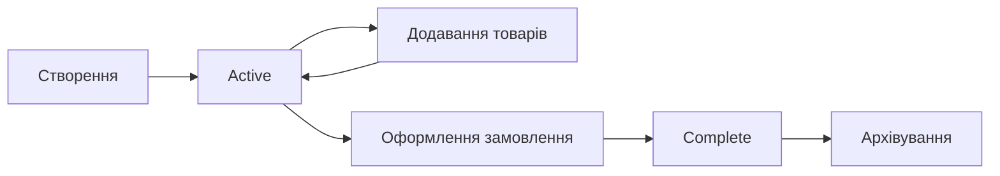

- [Cтруктура CMS Strapi](#cтруктура-cms-strapi)
  - [Collection Types](#collection-types)
    - [Collection Type - Cart](#collection-type---cart)
  - [Структура полів](#структура-полів)
    - [1. users\_permissions\_user](#1-users_permissions_user)
      - [Опис](#опис)
      - [Особливості](#особливості)
      - [Приклад використання](#приклад-використання)
    - [2. cart\_items](#2-cart_items)
      - [Опис](#опис-1)
      - [Особливості](#особливості-1)
      - [Приклад використання](#приклад-використання-1)
    - [3. payment\_status](#3-payment_status)
      - [Опис](#опис-2)
      - [Значення](#значення)
      - [Особливості](#особливості-2)
      - [Приклад використання](#приклад-використання-2)
  - [Повна структура даних](#повна-структура-даних)
    - [TypeScript Interface](#typescript-interface)
    - [JSON Schema Example](#json-schema-example)
  - [Базові операції CRUD](#базові-операції-crud)
    - [Create (Створення)](#create-створення)
    - [Read (Читання)](#read-читання)
    - [Update (Оновлення)](#update-оновлення)
    - [Delete (Видалення)](#delete-видалення)
  - [Зв'язки з іншими моделями](#звязки-з-іншими-моделями)
    - [1. User (plugin::users-permissions.user)](#1-user-pluginusers-permissionsuser)
    - [2. Cart Items (api::cart-item.cart-item)](#2-cart-items-apicart-itemcart-item)
  - [Індекси та оптимізація](#індекси-та-оптимізація)
    - [Рекомендовані індекси](#рекомендовані-індекси)
  - [Бізнес-логіка](#бізнес-логіка)
    - [Життєвий цикл кошика](#життєвий-цикл-кошика)
    - [Правила валідації](#правила-валідації)
  - [Приклади запитів](#приклади-запитів)
    - [GraphQL](#graphql)
    - [REST API](#rest-api)
  - [Примітки безпеки](#примітки-безпеки)
- [Публічні API ендпоїнти](#публічні-api-ендпоїнти)
    - [Кошик покупок](#кошик-покупок)
    - [Ендпоінти](#ендпоінти)
    - [1. Отримати кошик користувача](#1-отримати-кошик-користувача)
      - [Параметри запиту](#параметри-запиту)
      - [Заголовки](#заголовки)
      - [Відповідь успіху (200)](#відповідь-успіху-200)
      - [Відповідь якщо кошик порожній (200)](#відповідь-якщо-кошик-порожній-200)
    - [2. Додати товар в кошик](#2-додати-товар-в-кошик)
      - [Параметри запиту (Body)](#параметри-запиту-body)
      - [Заголовки](#заголовки-1)
      - [Відповідь успіху (200)](#відповідь-успіху-200-1)
      - [Можливі помилки](#можливі-помилки)
    - [3. Оновити кількість товару](#3-оновити-кількість-товару)
      - [Параметри запиту (Body)](#параметри-запиту-body-1)
      - [Заголовки](#заголовки-2)
      - [Відповідь успіху (200)](#відповідь-успіху-200-2)
      - [Відповідь при видаленні (quantity = 0)](#відповідь-при-видаленні-quantity--0)
      - [Можливі помилки](#можливі-помилки-1)
    - [4. Очистити кошик](#4-очистити-кошик)
      - [Параметри запиту](#параметри-запиту-1)
      - [Заголовки](#заголовки-3)
      - [Відповідь успіху (200)](#відповідь-успіху-200-3)
      - [Відповідь якщо кошик вже порожній (200)](#відповідь-якщо-кошик-вже-порожній-200)
      - [Можливі помилки](#можливі-помилки-2)
    - [5. Видалити товар з кошика](#5-видалити-товар-з-кошика)
      - [Параметри URL](#параметри-url)
      - [Заголовки](#заголовки-4)
      - [Відповідь успіху (200)](#відповідь-успіху-200-4)
      - [Можливі помилки](#можливі-помилки-3)
    - [6. Синхронізація гостьового кошика](#6-синхронізація-гостьового-кошика)
      - [Параметри запиту (Body)](#параметри-запиту-body-2)
      - [Заголовки](#заголовки-5)
      - [Відповідь успіху (200)](#відповідь-успіху-200-5)
      - [Статуси синхронізації](#статуси-синхронізації)
      - [Можливі помилки](#можливі-помилки-4)
  - [Коди помилок](#коди-помилок)
  - [Приклади використання](#приклади-використання)
    - [Додавання товару в кошик (JavaScript)](#додавання-товару-в-кошик-javascript)
    - [Отримання кошика (cURL)](#отримання-кошика-curl)
    - [Очищення кошика (Fetch API)](#очищення-кошика-fetch-api)
  - [Примітки](#примітки)
  - [Структура даних](#структура-даних)
    - [Cart (Кошик)](#cart-кошик)
    - [CartItem (Елемент кошика)](#cartitem-елемент-кошика)
    - [Product (Товар)](#product-товар)

# Cтруктура CMS Strapi

## Collection Types

### Collection Type - Cart

**Collection Name:** `carts`  
**Singular Name:** `cart`  
**Plural Name:** `carts`  
**Display Name:** Cart  
**Type:** Collection Type  

**Параметри:**
- ✅ Draft & Publish включено
- 🔄 Підтримка версій (draft/published)

---

## Структура полів

### 1. users_permissions_user

**Тип:** `relation`  
**Зв'язок:** `oneToOne` (один до одного)  
**Ціль:** `plugin::users-permissions.user`

#### Опис
Зв'язок з користувачем, якому належить кошик. Кожен користувач може мати лише один активний кошик.

#### Особливості
- Унікальний зв'язок (один користувач = один кошик)
- Обов'язкове поле для ідентифікації власника
- Використовується для фільтрації кошиків по користувачу

#### Приклад використання
```javascript
// Знайти кошик конкретного користувача
const userCart = await strapi.entityService.findMany('api::cart.cart', {
  filters: { users_permissions_user: userId },
  populate: { users_permissions_user: true }
});
```

---

### 2. cart_items

**Тип:** `relation`  
**Зв'язок:** `oneToMany` (один до багатьох)  
**Ціль:** `api::cart-item.cart-item`  
**Mapped By:** `cart`

#### Опис
Колекція товарів, що знаходяться в кошику. Один кошик може містити багато елементів (cart-items).

#### Особливості
- Двосторонній зв'язок з cart-item
- Автоматично оновлюється при додаванні/видаленні cart-items
- Підтримує повну популяцію вкладених даних

#### Приклад використання
```javascript
// Отримати кошик з усіма товарами
const cartWithItems = await strapi.entityService.findOne('api::cart.cart', cartId, {
  populate: {
    cart_items: {
      populate: {
        product: {
          populate: ['image', 'brand']
        }
      }
    }
  }
});
```

---

### 3. payment_status

**Тип:** `enumeration`  
**Можливі значення:**
- `active` (за замовчуванням)
- `complete`

#### Опис
Статус кошика, що визначає його поточний стан у процесі покупки.

#### Значення

| Значення | Опис | Використання |
|----------|------|--------------|
| `active` | Активний кошик | Користувач додає/видаляє товари |
| `complete` | Завершений кошик | Замовлення оформлено, кошик архівований |

#### Особливості
- За замовчуванням встановлюється `active`
- Використовується для фільтрації активних кошиків
- Після оформлення замовлення статус змінюється на `complete`

#### Приклад використання
```javascript
// Знайти тільки активний кошик користувача
const activeCart = await strapi.entityService.findMany('api::cart.cart', {
  filters: { 
    users_permissions_user: userId,
    payment_status: 'active'
  }
});

// Завершити кошик після оплати
await strapi.entityService.update('api::cart.cart', cartId, {
  data: { payment_status: 'complete' }
});
```

---

## Повна структура даних

### TypeScript Interface

```typescript
interface Cart {
  id: number;
  documentId: string;
  
  // Основні поля
  users_permissions_user: {
    id: number;
    username: string;
    email: string;
  };
  
  cart_items: CartItem[];
  
  payment_status: 'active' | 'complete';
  
  // Системні поля Strapi
  createdAt: string;
  updatedAt: string;
  publishedAt: string | null;
  createdBy?: User;
  updatedBy?: User;
}

interface CartItem {
  id: number;
  documentId: string;
  cart: Cart;
  product: Product;
  quantity: number;
  price_at_time: number;
}
```

### JSON Schema Example

```json
{
  "id": 1,
  "documentId": "abc123xyz789",
  "users_permissions_user": {
    "id": 15,
    "documentId": "user456",
    "username": "john_doe",
    "email": "john@example.com"
  },
  "cart_items": [
    {
      "id": 1,
      "documentId": "item123",
      "quantity": 2,
      "price_at_time": 299.99,
      "product": {
        "id": 5,
        "documentId": "prod789",
        "name": "iPhone 15 Pro",
        "price": 299.99,
        "stockQuantity": 25
      }
    }
  ],
  "payment_status": "active",
  "createdAt": "2024-01-15T10:30:00.000Z",
  "updatedAt": "2024-01-15T14:25:00.000Z",
  "publishedAt": "2024-01-15T10:30:00.000Z"
}
```

---

## Базові операції CRUD

### Create (Створення)

```javascript
// Створити новий кошик для користувача
const newCart = await strapi.entityService.create('api::cart.cart', {
  data: {
    users_permissions_user: userId,
    payment_status: 'active'
  }
});
```

### Read (Читання)

```javascript
// Отримати кошик з повною популяцією
const cart = await strapi.entityService.findOne('api::cart.cart', cartId, {
  populate: {
    users_permissions_user: {
      fields: ['username', 'email']
    },
    cart_items: {
      populate: {
        product: {
          populate: ['image', 'brand', 'category']
        }
      }
    }
  }
});
```

### Update (Оновлення)

```javascript
// Оновити статус кошика
const updatedCart = await strapi.entityService.update('api::cart.cart', cartId, {
  data: {
    payment_status: 'complete'
  }
});
```

### Delete (Видалення)

```javascript
// Видалити кошик (рідко використовується)
await strapi.entityService.delete('api::cart.cart', cartId);
```

---

## Зв'язки з іншими моделями

### 1. User (plugin::users-permissions.user)
- **Тип зв'язку:** One-to-One
- **Опис:** Кожен кошик належить конкретному користувачу
- **Використання:** Ідентифікація власника кошика

### 2. Cart Items (api::cart-item.cart-item)
- **Тип зв'язку:** One-to-Many  
- **Опис:** Один кошик містить багато товарів
- **Використання:** Зберігання товарів та їх кількості

---

## Індекси та оптимізація

### Рекомендовані індекси

```sql
-- Індекс для швидкого пошуку кошика користувача
CREATE INDEX idx_cart_user_status ON carts (users_permissions_user, payment_status);

-- Індекс для пошуку активних кошиків
CREATE INDEX idx_cart_status ON carts (payment_status);

-- Індекс для сортування по даті створення
CREATE INDEX idx_cart_created ON carts (created_at);
```

---

## Бізнес-логіка

### Життєвий цикл кошика



### Правила валідації

1. **Унікальність активного кошика:**
   ```javascript
   // Один користувач може мати лише один активний кошик
   const existingActiveCart = await strapi.entityService.findMany('api::cart.cart', {
     filters: { 
       users_permissions_user: userId,
       payment_status: 'active'
     }
   });
   ```

2. **Автоматичне створення:**
   ```javascript
   // Якщо у користувача немає активного кошика - створити
   if (!existingActiveCart.length) {
     await strapi.entityService.create('api::cart.cart', {
       data: {
         users_permissions_user: userId,
         payment_status: 'active'
       }
     });
   }
   ```

---

## Приклади запитів

### GraphQL
```graphql
query GetUserCart($userId: ID!) {
  carts(filters: { 
    users_permissions_user: { id: { eq: $userId } },
    payment_status: { eq: "active" }
  }) {
    data {
      id
      documentId
      payment_status
      cart_items {
        data {
          id
          quantity
          price_at_time
          product {
            data {
              name
              price
              image {
                data {
                  attributes {
                    url
                  }
                }
              }
            }
          }
        }
      }
    }
  }
}
```

### REST API
```bash
# Отримати активний кошик користувача
GET /api/carts?filters[users_permissions_user][$eq]=15&filters[payment_status][$eq]=active&populate=*

# Створити новий кошик
POST /api/carts
{
  "data": {
    "users_permissions_user": 15,
    "payment_status": "active"
  }
}

# Оновити статус кошика  
PUT /api/carts/1
{
  "data": {
    "payment_status": "complete"
  }
}
```

---

## Примітки безпеки

1. **Авторизація:** Користувачі повинні мати доступ лише до своїх кошиків
2. **Валідація:** Перевірка належності кошика користувачу перед операціями
3. **Політики:** Налаштування permissions для обмеження доступу

```javascript
// Приклад політики безпеки
module.exports = async (policyContext, config, { strapi }) => {
  const { user } = policyContext.state;
  const cartId = policyContext.params.id;
  
  const cart = await strapi.entityService.findOne('api::cart.cart', cartId);
  
  return cart.users_permissions_user === user.id;
};
```


# Публічні API ендпоїнти

### Кошик покупок

**Base URL:** `/api`  
**Авторизація:** Bearer Token (JWT)  
**Content-Type:** `application/json`

---

### Ендпоінти

### 1. Отримати кошик користувача

**GET** `/cart`

Повертає поточний кошик авторизованого користувача з усіма товарами.

#### Параметри запиту
Немає

#### Заголовки
```
Authorization: Bearer <jwt_token>
```

#### Відповідь успіху (200)
```json
{
  "cart": {
    "id": 1,
    "documentId": "abc123",
    "users_permissions_user": 1,
    "createdAt": "2024-01-15T10:30:00.000Z",
    "updatedAt": "2024-01-15T12:45:00.000Z"
  },
  "cart_items": [
    {
      "id": 1,
      "documentId": "item123",
      "quantity": 2,
      "price_at_time": 299.99,
      "product": {
        "id": 1,
        "documentId": "prod123",
        "name": "iPhone 15",
        "price": 299.99,
        "stockQuantity": 50,
        "brand": {
          "name": "Apple"
        }
      }
    }
  ]
}
```

#### Відповідь якщо кошик порожній (200)
```json
{
  "cart": null,
  "cart_items": []
}
```

---

### 2. Додати товар в кошик

**POST** `/cart/add`

Додає товар в кошик користувача або збільшує кількість існуючого товару.

#### Параметри запиту (Body)
```json
{
  "productId": "qf3878zap321vh8gfzywfoae", // обов'язково
  "quantity": 1 // опціонально, за замовчуванням 1
}
```

#### Заголовки
```
Authorization: Bearer <jwt_token>
Content-Type: application/json
```

#### Відповідь успіху (200)
```json
{
  "updatedCart": {
    "id": 1,
    "documentId": "cart123",
    "cart_items": [
      {
        "id": 1,
        "documentId": "item123",
        "quantity": 3,
        "price_at_time": 299.99,
        "product": {
          "id": 1,
          "documentId": "prod123",
          "name": "iPhone 15",
          "price": 299.99,
          "image": {
            "url": "/uploads/iphone.jpg",
            "alternativeText": "iPhone 15"
          },
          "brand": {
            "name": "Apple"
          }
        }
      }
    ]
  }
}
```

#### Можливі помилки
- **400** - Product ID is required
- **404** - Product not found  
- **400** - Sorry, we don't have enough stock at the moment
- **500** - Error adding to cart

---

### 3. Оновити кількість товару

**PUT** `/cart/update-quantity`

Оновлює кількість конкретного товару в кошику.

#### Параметри запиту (Body)
```json
{
  "productId": "qf3878zap321vh8gfzywfoae", // обов'язково
  "quantity": 5 // обов'язково, якщо 0 - товар видаляється
}
```

#### Заголовки
```
Authorization: Bearer <jwt_token>
Content-Type: application/json
```

#### Відповідь успіху (200)
```json
{
  "updatedCart": {
    "id": 1,
    "documentId": "cart123",
    "cart_items": [
      {
        "id": 1,
        "documentId": "item123",
        "quantity": 5,
        "price_at_time": 299.99,
        "product": {
          "id": 1,
          "documentId": "prod123",
          "name": "iPhone 15",
          "price": 299.99,
          "image": {
            "url": "/uploads/iphone.jpg",
            "alternativeText": "iPhone 15"
          },
          "brand": {
            "name": "Apple"
          }
        }
      }
    ]
  },
  "message": "Кількість оновлено"
}
```

#### Відповідь при видаленні (quantity = 0)
```json
{
  "message": "Товар видалено з кошика"
}
```

#### Можливі помилки
- **400** - ID товару та кількість обов'язкові
- **400** - Кількість не може бути негативною
- **404** - Кошик не знайдено
- **404** - Товар не знайдено в кошику
- **400** - Недостатньо товару на складі

---

### 4. Очистити кошик

**DELETE** `/cart/clear`

Видаляє всі товари з кошика користувача.

#### Параметри запиту
Немає

#### Заголовки
```
Authorization: Bearer <jwt_token>
```

#### Відповідь успіху (200)
```json
{
  "success": true,
  "message": "Кошик очищено",
  "cartId": "cart123"
}
```

#### Відповідь якщо кошик вже порожній (200)
```json
{
  "success": true,
  "message": "Кошик вже порожній"
}
```

#### Можливі помилки
- **401** - Потрібна авторизація
- **500** - Помилка сервера

---

### 5. Видалити товар з кошика

**DELETE** `/cart/remove/:productId`

Видаляє конкретний товар з кошика.

#### Параметри URL
- `productId` - Document ID товару для видалення

#### Заголовки
```
Authorization: Bearer <jwt_token>
```

#### Відповідь успіху (200)
```json
{
  "success": true,
  "message": "Товар видалено з кошика"
}
```

#### Можливі помилки
- **401** - Потрібна авторизація
- **404** - Кошик не знайдено
- **404** - Елемент кошика не знайдено
- **500** - Помилка сервера

---

### 6. Синхронізація гостьового кошика

**POST** `/cart/sync-guest`

Синхронізує товари з гостьового кошика з кошиком авторизованого користувача.

#### Параметри запиту (Body)
```json
{
  "guestCartItems": [
    {
      "productId": "prod123",
      "quantity": 2
    },
    {
      "productId": "prod456", 
      "quantity": 1
    }
  ]
}
```

#### Заголовки
```
Authorization: Bearer <jwt_token>
Content-Type: application/json
```

#### Відповідь успіху (200)
```json
{
  "message": "Синхронізація завершена",
  "results": [
    {
      "productId": "prod123",
      "status": "merged",
      "message": "Кількість збільшено"
    },
    {
      "productId": "prod456",
      "status": "added", 
      "message": "Товар додано"
    }
  ]
}
```

#### Статуси синхронізації
- `added` - Товар додано в кошик
- `merged` - Кількість збільшено (товар вже був в кошику)
- `partial` - Додано максимально можливу кількість
- `error` - Помилка (товар не знайдено або недостатньо на складі)

#### Можливі помилки
- **400** - Некоректні дані гостьового кошика
- **500** - Помилка синхронізації

---

## Коди помилок

| Код | Значення | Опис |
|-----|----------|------|
| 200 | OK | Запит виконано успішно |
| 400 | Bad Request | Неправильні параметри запиту |
| 401 | Unauthorized | Потрібна авторизація |
| 404 | Not Found | Ресурс не знайдено |
| 500 | Internal Server Error | Внутрішня помилка сервера |

---

## Приклади використання

### Додавання товару в кошик (JavaScript)

```javascript
const response = await fetch('/api/cart/add', {
  method: 'POST',
  headers: {
    'Authorization': `Bearer ${token}`,
    'Content-Type': 'application/json'
  },
  body: JSON.stringify({
    productId: 'qf3878zap321vh8gfzywfoae',
    quantity: 2
  })
});

const data = await response.json();
console.log(data.updatedCart);
```

### Отримання кошика (cURL)

```bash
curl -X GET "http://localhost:1337/api/cart" \
  -H "Authorization: Bearer YOUR_JWT_TOKEN" \
  -H "Content-Type: application/json"
```

### Очищення кошика (Fetch API)

```javascript
const response = await fetch('/api/cart/clear', {
  method: 'DELETE',
  headers: {
    'Authorization': `Bearer ${token}`
  }
});

const result = await response.json();
console.log(result.message); // "Кошик очищено"
```

---

## Примітки

1. **Авторизація**: Всі ендпоінти вимагають авторизації через JWT токен
2. **Document ID**: Strapi v5 використовує `documentId` для ідентифікації записів
3. **Популяція**: Відповіді включають повну інформацію про товари, бренди та зображення
4. **Валідація**: API автоматично перевіряє наявність товару на складі
5. **Кешування**: Рекомендується кешувати дані кошика на клієнті для покращення UX

## Структура даних

### Cart (Кошик)
```typescript
interface Cart {
  id: number;
  documentId: string;
  users_permissions_user: number;
  payment_status?: string;
  createdAt: string;
  updatedAt: string;
  cart_items: CartItem[];
}
```

### CartItem (Елемент кошика)
```typescript
interface CartItem {
  id: number;
  documentId: string;
  quantity: number;
  price_at_time: number;
  product: Product;
}
```

### Product (Товар)
```typescript
interface Product {
  id: number;
  documentId: string;
  name: string;
  price: number;
  stockQuantity: number;
  image?: {
    url: string;
    alternativeText?: string;
  };
  brand?: {
    name: string;
  };
}
```
